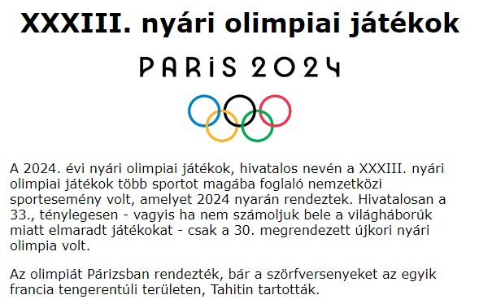
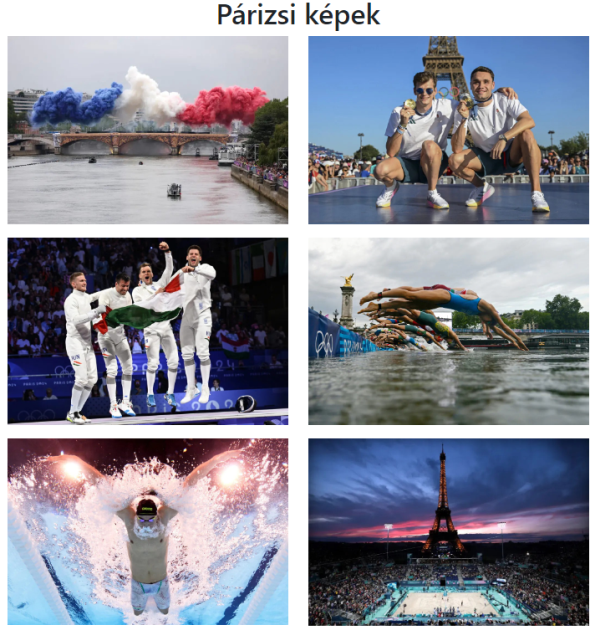
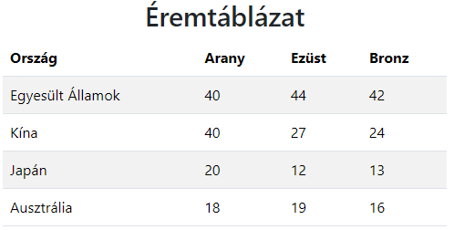
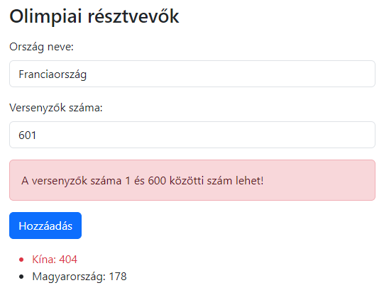
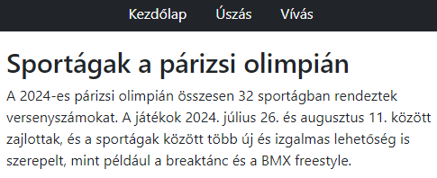
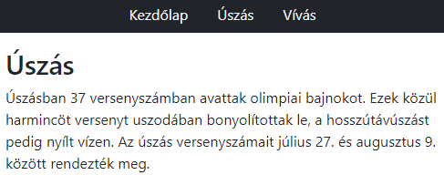
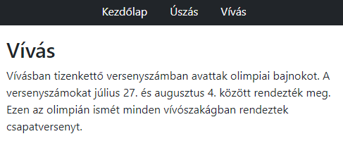
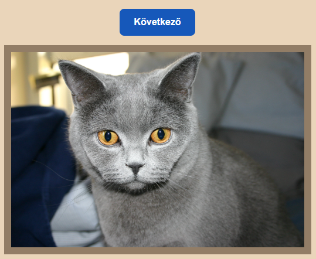

# Vizsgafeladat

## Előkészületek

* Jelentkezzen be GitHub fiókjába!
* Készítsen egy forkot erről a repositoryról!
* A másolatot klónozza le a saját számítógépére!
* Ebben a másolatban dolgozzon, és a módosításokat töltse fel a GitHub-ra!
* A végén a saját GitHub repository címét adja be!

Minden feladatot úgy kell megoldania, hogy az App.test.js fájlokban lévő tesztek sikeresen lefussanak!

## 1. feladat

Készítsen egy React alkalmazást az alábbi minta szerint!

Az oldal tartalmának maximális szélessége 800 képpont legyen, két oldalon azonos méretű margóval! Az oldal körül legyen belső margó, amelynek szélessége megegyezik az alapértelmezett betűmérettel!

Az oldal betűtípusa Verdana, vagy ennek hiányában az alapértelmezett talpatlan betűtípus legyen!

A fejlécben a szöveg és a kép legyenek középre igazítva!

A cím első szintű címsor legyen!

Alatta a *public* mappában található *parizs.png* kép jelenjen meg, "Párizs 2024" alternatív szöveggel, 250 képpont szélességgel, a képarányokat megtartva!

Az oldal fő részében két bekezdés legyen a *feladat1.txt* fájlban található szöveggel!

## 2. feladat

Készítsen egy React alkalmazást az alábbi minta alapján!

A képeket a *public/kepek* mappában találja. A képekhez tartozó alternatív szöveg olimpia1, ..., olimpia6 legyen!

Az oldalt Bootstrap alkalmazásával formázza a következők szerint:

* Az oldal tartalma egy tárolóba kerüljön, amely biztosítja két oldalon az egyenlő margókat!
* Az oldal címe egyes szintű címsor legyen középre igazítva!
* A képek közepesnél kisebb kijelzőnél (768 px szélesség alatt) egy oszlopban, legalább közepes, de nem nagy kijelzőnél (768 és 992 px szélesség között) két oszlopban, ennél szélesebb kijelzőn három oszlopban jelenjenek meg!
* A képek mérete az oldal méretének megfelelően változzon!

## 3. feladat

Készítsen egy React alkalmazást az alábbi minta szerint!

Az adatokat írja az alkalmazáson belül egy objektumokból álló tömbbe, és ez alapján jelenítse meg a sorokban!

Az oldalt Bootstrap alkalmazásával formázza a következők szerint:

* Az oldal tartalma egy tárolóba kerüljön, amely biztosítja két oldalon az egyenlő margókat!
* Az oldal címe egyes szintű címsor legyen középre igazítva!
* A táblázatnak legyen fejlécsora!
* A táblázat sorainak háttere felváltva szürke és fehér legyen!

## 4. feladat

Készítsen egy alkalmazást, amelyben az országok olimpiai versenyzőinek számát lehet megadni egy formon
a minta szerint!

Az alkalmazást kizárólag Bootstrap használatával formázza!

Az ország nevének legalább 3 karakter hosszúnak kell lennie. Ha rövidebb, akkor jelenjen meg a "Az ország neve nem lehet 3 karakternél rövidebb!" hibaüzenet!

A versenyzők száma 1 és 600 közötti szám lehet. Ezt olyan beviteli mezővel valósítsa meg, amelybe csak számokat lehet beírni! Ha az ország neve jó, de a versenyzők száma a határokon kívül van, akkor jelenjen meg a "A versenyzők száma 1 és 600 közötti szám lehet!" hibaüzenet!

Ha jók az adatok, akkor a Hozzáadás gomb megnyomásakor adja hozzá őket a listához! Azoknak az országoknak az adatai, akik 200-nál több versenyzőt indítanak, piros betűkkel jelenjenek meg!

## 5. feladat

Készítsen Single Page Application-t, amely három oldalból áll!

Az alkalmazást Bootstrap használatával formázza! Az oldalak tartalma egy-egy konténerben legyen!

Minden oldal tetején legyen egy olyan navigáció, amely mindhárom oldal hivatkozását tartalmazza! A navigáció háttere sötét, betűszíne világos legyen, és a hivatkozások legyenek középre igazítva!

Az oldalak szövegét megtalálja a *feladat5.txt* fájlban.

Kezdőlap:

Úszás lap:

Vívás lap:

## 6. feladat

A [https://api.thecatapi.com/v1/images/search](https://api.thecatapi.com/v1/images/search) címen lévő API egy véletlenül választott macska kép címét adja vissza. A kép címe a kapott tömb első elemének url mezőjében van.

Készítsen egy olyan React alkalmazást, amely induláskor és egy gomb megnyomásakor lekér egy képet, és megjeleníti azt az alábbi minta szerint:

A gombot és a képet egy Macska nevű komponenssel jelenítse meg, amelynek adja át a kép címét és egy függvényt, amely lekéri a következő képet!

Az alkalmazást SCSS segítségével formázza meg úgy, hogy importálja az src mappában található *_colors.scss* fájlból a színeket! (hatter: oldal háttere, gomb: gomb háttere, keret: kép szegélye)

A szöveg Verdana vagy az alapértelmezett talpatlan betűtípussal jelenjen meg!

A gombot formázza meg a minta alapján!

A kép a teljes szélesség 90%-át, de legfeljebb 500 képpontot foglaljon el! A kép szegélye 12 képpont széles legyen!

Amíg az adatok letöltődnek, az src mappában található *loading.gif* kép legyen látható!
